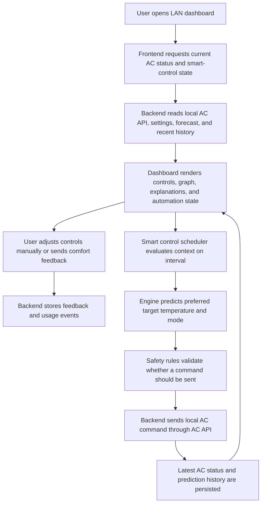

## 1. Product Overview

Smart AC Controller is a LAN-hosted web application for the OrangePi that combines manual AC control with an automated comfort-and-efficiency controller.

* It solves the gap between a basic vendor mobile app and a home-local control center by combining live status, automation, weather awareness, learning from feedback, and a richer visual interface.

* Its value is improved comfort, lower energy waste, and a reusable local control surface that future assistants, scripts, or automations can call through the existing AC API.

## 2. Core Features

### 2.1 User Roles

| Role               | Registration Method                                        | Core Permissions                                                                               |
| ------------------ | ---------------------------------------------------------- | ---------------------------------------------------------------------------------------------- |
| Household operator | No public registration, LAN access with local app settings | View status, control AC, configure smart control, provide comfort feedback, review predictions |

### 2.2 Feature Module

1. **Dashboard page**: live AC status, basic controls, smart controller toggle, quick comfort feedback, prediction graph.
2. **Schedules and Insights page**: sleep profile editor, hourly comfort profile, recent automation decisions, historical usage summaries.
3. **Settings page**: location, timezone, weather preferences, learning preferences, LAN/API connection settings, feature safeguards.

### 2.3 Page Details

| Page Name              | Module Name                  | Feature description                                                                                                                                                                               |
| ---------------------- | ---------------------------- | ------------------------------------------------------------------------------------------------------------------------------------------------------------------------------------------------- |
| Dashboard              | Live status header           | Shows current AC power, mode, target temperature, current temperature, fan, swing, sleep, UVC, and display state loaded at page startup and refreshed after every command                         |
| Dashboard              | Basic control panel          | Offers power, mode, target temperature, fan, sleep, swing, display, and UVC controls through the existing local AC API                                                                            |
| Dashboard              | Smart control card           | Lets the user enable or disable automation, see why the current recommendation exists, and inspect current context such as hour, weather, outside temperature, and AC-reported indoor temperature |
| Dashboard              | Comfort feedback             | Provides `Too cold` and `Too hot` buttons that apply an immediate correction and log a labeled feedback event for future learning                                                                 |
| Dashboard              | Temperature projection graph | Shows past hourly average target temperature, current effective state, and future projected target temperature colored by AC mode across the day timeline                                         |
| Dashboard              | Automation activity feed     | Lists recent smart decisions, skipped actions, and safety guard reasons so automation is understandable                                                                                           |
| Schedules and Insights | Sleep profile editor         | Lets the user define one or more sleep windows with preferred target temperatures, fan behavior, and optional wake-up ramping                                                                     |
| Schedules and Insights | Comfort pattern summary      | Shows learned hourly tendencies, common manual overrides, and the effect of feedback under similar conditions                                                                                     |
| Schedules and Insights | Context analysis             | Summarizes weather, time-of-day, indoor temperature, and recent command history to explain why projections change                                                                                 |
| Settings               | Location and weather         | Collects city or coordinates, resolves timezone, and configures weather forecast usage for the automation engine                                                                                  |
| Settings               | Learning controls            | Configures how strongly manual actions and `Too cold` / `Too hot` feedback affect future projections and recommendations                                                                          |
| Settings               | System safeguards            | Defines minimum cycle interval, max temperature changes per step, quiet hours, and fallback behavior when weather data is unavailable                                                             |

## 3. Core Process

The user opens the LAN app, sees the current AC state immediately, and can either control the unit manually or enable smart control. When smart control is enabled, the app continuously evaluates local context such as time of day, indoor temperature from the AC, weather conditions, forecast trend, sleep schedule, and recent manual feedback to compute a recommended target state. The engine sends minimal AC changes through the local API, records outcomes, and updates the graph and explanation panels. The user can still intervene at any time, and those interventions become training signals for future predictions.

## 4. User Interface Design

### 4.1 Design Style

* Primary colors: deep midnight blue, muted slate, cool cyan, soft amber accents for warnings and sleep windows

* Button style: tactile rounded panels with high-contrast active states and subtle glass overlays

* Fonts and sizes: editorial display font for headings, readable humanist sans-serif for controls and charts, strong numeric styling for temperature values

* Layout style: responsive for desktop and mobile usage, split dashboard with persistent live-status rail, graph-first center canvas, and stacked smart-control cards

* Icon style suggestions: climate and time icons with thin technical strokes, restrained animated indicators for automation and weather trends

### 4.2 Page Design Overview

| Page Name              | Module Name                  | UI Elements                                                                                                              |
| ---------------------- | ---------------------------- | ------------------------------------------------------------------------------------------------------------------------ |
| Dashboard              | Live status header           | Large temperature numerals, current mode pill, online indicator, quick-refresh control, subtle status shimmer on updates |
| Dashboard              | Basic control panel          | Large segmented mode selector, tactile temperature stepper, fan chips, toggle switches, one-click apply feedback         |
| Dashboard              | Smart control card           | Automation toggle, confidence badge, explanation bullet list, current context chips, next action countdown               |
| Dashboard              | Temperature projection graph | Multi-color line and area graph, hour markers, forecast shading, mode color legend, hover tooltips                       |
| Dashboard              | Comfort feedback             | Two oversized action buttons with warm/cool semantic coloring and visible immediate effect summaries                     |
| Schedules and Insights | Sleep profile editor         | Timeline bands, draggable hour ranges, editable target presets, night-theme visual emphasis                              |
| Schedules and Insights | Pattern summary cards        | Hourly heatmap, override frequency chips, mode distribution badges, recent decisions list                                |
| Settings               | Location and weather         | Form controls, geolocation helper text, timezone preview, weather-source health indicator                                |
| Settings               | Safeguards and learning      | Sliders, toggles, explanatory text, simulation preview for control aggressiveness                                        |

### 4.3 Responsiveness

* Desktop-first layout for laptop and desktop use on the LAN

* Tablet adaptation preserves the graph and control panel side-by-side when possible

* Mobile adaptation stacks cards vertically, keeps quick controls fixed near the top, and simplifies chart interactions

* Touch targets remain large enough for quick comfort feedback and sleep profile editing

