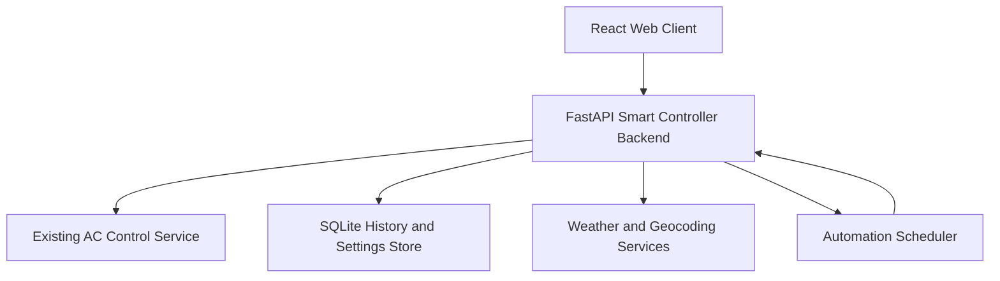
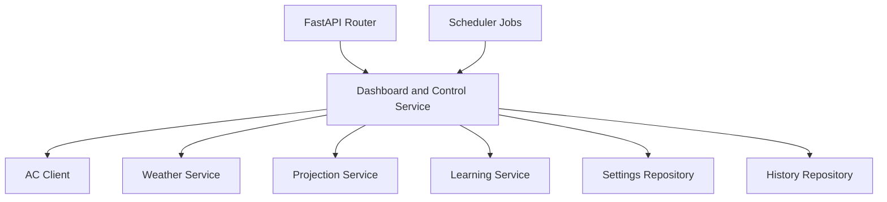
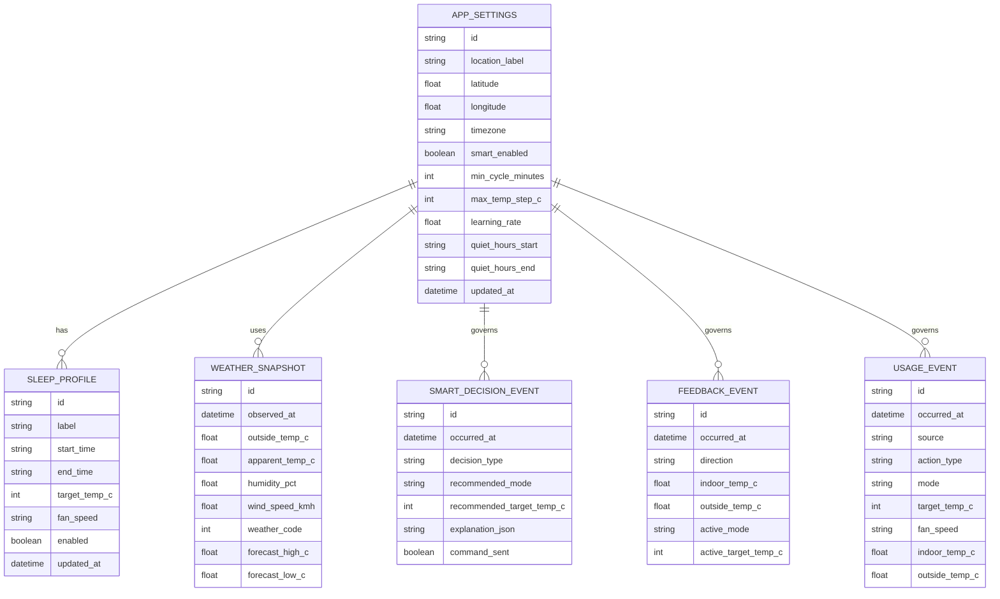

## 1. Architecture Design



## 2. Technology Description
- Frontend: React 18 + TypeScript + Vite + Tailwind CSS + Recharts
- Backend: FastAPI + Pydantic + APScheduler
- Data layer: SQLite for settings, event history, projections, sleep profiles, and learned weights
- Existing integration: current `ac-control-service` FastAPI endpoints on the OrangePi LAN
- External services: Open-Meteo forecast API and geocoding/timezone endpoints with no API key requirement
- Initialization tool: Vite

## 3. Route Definitions
| Route | Purpose |
|-------|---------|
| / | Main dashboard with live status, manual controls, smart control card, and projection graph |
| /insights | Sleep profiles, hourly comfort patterns, automation history, and usage summaries |
| /settings | Location, weather, timezone, safeguards, learning controls, and AC API connection settings |

## 4. API Definitions

### 4.1 Frontend-facing backend endpoints
```ts
type AcStatus = {
  online: boolean;
  power: boolean;
  mode: "off" | "auto" | "cool" | "dry" | "fan";
  target_temp_c: number;
  current_temp_c: number | null;
  fan_speed: "auto" | "low" | "middle" | "high" | "strong" | "mute";
  sleep: boolean;
  uvc: boolean;
  display: boolean;
  horizontal_swing: boolean;
  vertical_swing: "fixed" | "swing";
  vertical_swing_raw?: string | null;
  fault_code?: number | null;
  source: string;
};

type SmartControlState = {
  enabled: boolean;
  next_evaluation_at?: string | null;
  learned_bias_c: number;
  confidence: number;
  explanation: string[];
  context: {
    local_time_iso: string;
    timezone: string;
    outside_temp_c?: number | null;
    weather_code?: number | null;
    forecast_high_c?: number | null;
    forecast_low_c?: number | null;
    indoor_temp_c?: number | null;
  };
};

type ProjectionPoint = {
  hour_label: string;
  minutes_from_midnight: number;
  segment: "past" | "current" | "future";
  mode: "off" | "auto" | "cool" | "dry" | "fan";
  target_temp_c: number;
};

type SleepProfile = {
  id: string;
  label: string;
  start_time: string;
  end_time: string;
  target_temp_c: number;
  fan_speed?: "auto" | "low" | "middle" | "high" | "mute";
  enabled: boolean;
};

type ManualApplyRequest = {
  power?: boolean;
  mode?: "auto" | "cool" | "dry" | "fan";
  target_temp_c?: number;
  fan_speed?: "auto" | "low" | "middle" | "high" | "strong" | "mute";
  sleep?: boolean;
  uvc?: boolean;
  display?: boolean;
  horizontal_swing?: boolean;
  vertical_swing?: "fixed" | "swing";
};

type ComfortFeedbackRequest = {
  direction: "too_cold" | "too_hot";
  note?: string;
};

type SmartSettingsRequest = {
  enabled?: boolean;
  min_cycle_minutes?: number;
  max_temp_step_c?: number;
  quiet_hours_start?: string | null;
  quiet_hours_end?: string | null;
  learning_rate?: number;
};
```

| Method | Route | Purpose |
|--------|-------|---------|
| GET | /api/dashboard | Returns current AC status, smart-control state, latest weather, and graph data |
| POST | /api/manual/apply | Sends a grouped manual command to the AC through `/ac/apply-batch` |
| POST | /api/manual/feedback | Records `too_hot` or `too_cold`, applies an immediate corrective adjustment, and updates learned bias |
| GET | /api/smart-control | Returns smart-control status, current explanation, and automation configuration |
| POST | /api/smart-control | Enables or disables automation and updates safeguards |
| POST | /api/smart-control/evaluate | Runs an immediate automation evaluation for testing |
| GET | /api/projections/day | Returns hourly past-average, current, and predicted target temperature points |
| GET | /api/sleep-profiles | Lists saved sleep profiles |
| POST | /api/sleep-profiles | Creates or updates a sleep profile |
| DELETE | /api/sleep-profiles/:id | Deletes a sleep profile |
| GET | /api/settings | Returns location, timezone, weather source, and learning settings |
| POST | /api/settings | Updates location, timezone, weather preferences, and model settings |

## 5. Server Architecture Diagram



## 6. Data Model

### 6.1 Data Model Definition


### 6.2 Data Definition Language
```sql
create table if not exists app_settings (
  id text primary key,
  location_label text not null,
  latitude real not null,
  longitude real not null,
  timezone text not null,
  smart_enabled integer not null default 0,
  min_cycle_minutes integer not null default 15,
  max_temp_step_c integer not null default 2,
  learning_rate real not null default 0.25,
  quiet_hours_start text,
  quiet_hours_end text,
  updated_at text not null
);

create table if not exists sleep_profile (
  id text primary key,
  label text not null,
  start_time text not null,
  end_time text not null,
  target_temp_c integer not null,
  fan_speed text,
  enabled integer not null default 1,
  updated_at text not null
);

create table if not exists weather_snapshot (
  id text primary key,
  observed_at text not null,
  outside_temp_c real,
  apparent_temp_c real,
  humidity_pct real,
  wind_speed_kmh real,
  weather_code integer,
  forecast_high_c real,
  forecast_low_c real
);

create table if not exists usage_event (
  id text primary key,
  occurred_at text not null,
  source text not null,
  action_type text not null,
  mode text,
  target_temp_c integer,
  fan_speed text,
  indoor_temp_c real,
  outside_temp_c real
);

create table if not exists feedback_event (
  id text primary key,
  occurred_at text not null,
  direction text not null,
  indoor_temp_c real,
  outside_temp_c real,
  active_mode text,
  active_target_temp_c integer
);

create table if not exists smart_decision_event (
  id text primary key,
  occurred_at text not null,
  decision_type text not null,
  recommended_mode text,
  recommended_target_temp_c integer,
  explanation_json text not null,
  command_sent integer not null default 0
);

create index if not exists idx_usage_event_occurred_at on usage_event (occurred_at);
create index if not exists idx_feedback_event_occurred_at on feedback_event (occurred_at);
create index if not exists idx_smart_decision_event_occurred_at on smart_decision_event (occurred_at);
create index if not exists idx_weather_snapshot_observed_at on weather_snapshot (observed_at);
```

## 7. Automation Strategy Notes
- Learning starts with lightweight heuristics rather than a heavy ML or LLM dependency.
- The recommendation engine combines:
  - hour of day
  - sleep profile state
  - indoor temperature from the AC
  - current outside temperature
  - short-term forecast trend
  - recent manual overrides
  - `too_hot` and `too_cold` feedback bias
- Safety rules prevent noisy behavior:
  - minimum interval between commands
  - maximum target-temperature step per adjustment
  - optional quiet hours for less aggressive changes
  - no repeated command if predicted state matches current state
- Future learning improvements can expand from weighted heuristics to more advanced forecasting without changing the web app structure.
